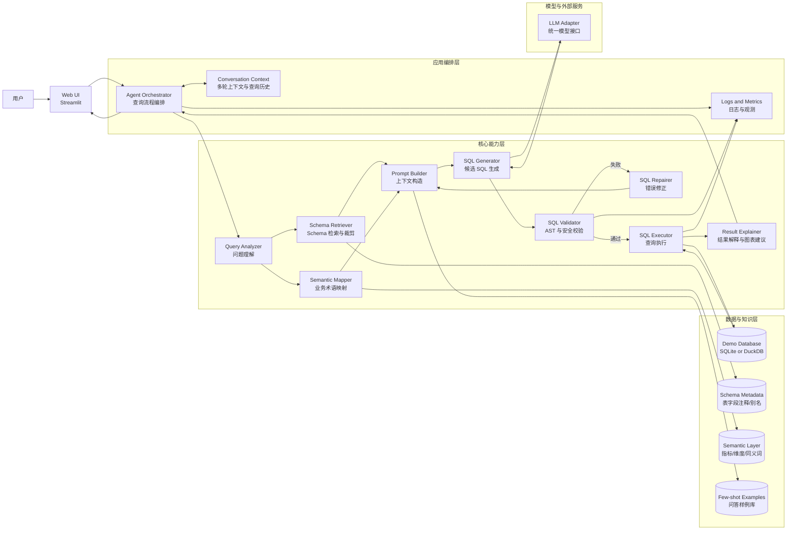

# NL2SQL Agent 系统架构图

## 绘图工具选择

本项目选用 Mermaid 作为架构图工具，原因如下：

- 文本化存储，适合和课程项目代码一起纳入版本管理
- 修改成本低，后续迭代模块时不需要重画图片
- 可以直接嵌入 Markdown，便于写报告和答辩材料
- 对当前这种分层架构和流程闭环表达非常合适

## 系统架构图

## 图中重点说明

### 1. 不是单次直出 SQL

系统不是“问题直接丢给模型”，而是先经过：

- 问题理解
- schema 检索
- 语义映射
- prompt 构造
- SQL 校验
- 执行反馈修正

这体现了项目的技术深度。

### 2. 校验与修正形成闭环

SQL Validator 失败后不会直接结束，而是进入 SQL Repairer，再回到 Prompt Builder 和 SQL Generator 继续修复。这是系统稳定性的关键设计。

### 3. 数据层不是只有数据库

除了数据库本身，系统还依赖：

- Schema Metadata
- Semantic Layer
- Few-shot Examples

这三部分共同构成“不是纯 API 调用”的核心上下文系统。

### 4. 适合课程展示

这张图同时体现了：

- 分层架构
- 核心模块
- 数据流闭环
- 错误恢复机制

非常适合直接放进课程报告或答辩 PPT。