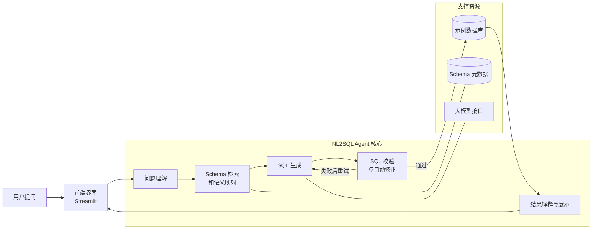

# NL2SQL Agent 答辩 PPT 简化架构图

## 使用说明

这版图专门面向答辩 PPT，目标是：

- 简单易懂
- 一眼看出主流程
- 突出项目不是纯 API 调用
- 保留最关键的技术亮点

## 简化架构图

## 这张图答辩时怎么讲

建议只讲 4 个点。

### 1. 主流程很清晰

用户输入问题后，系统依次经过：

- 问题理解
- Schema 检索和语义映射
- SQL 生成
- SQL 校验与自动修正
- 查询结果解释与展示

### 2. 项目不是纯 API 调用

最值得强调的是中间两层：

- Schema 检索和语义映射
- SQL 校验与自动修正

这两部分说明系统不是“把问题直接丢给模型”，而是有自定义的上下文选择和约束机制。

### 3. 有闭环，演示更稳定

如果 SQL 校验失败，系统不会直接报错，而是回到生成阶段自动重试。

这能明显提升课堂展示稳定性。

### 4. 结构简单但有层次

图里只保留：

- 用户侧
- Agent 核心
- 支撑资源

这样适合 PPT，一页就能讲清楚，不会让老师被细节淹没。

## 适合放在 PPT 上的标题

可以直接用下面任一标题：

- NL2SQL Agent 系统总体架构
- NL2SQL Agent 核心处理流程
- 面向课程项目的 NL2SQL Agent 架构设计